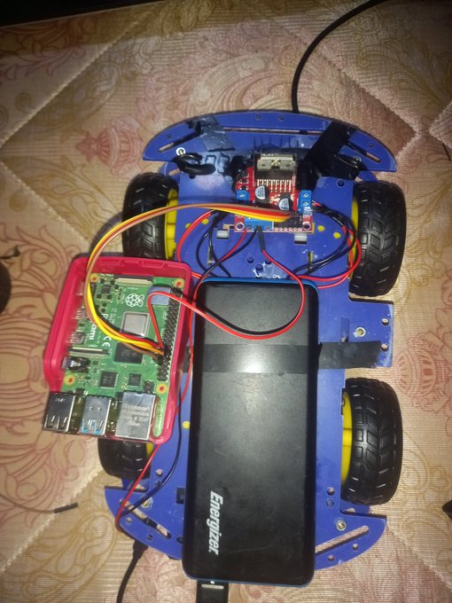
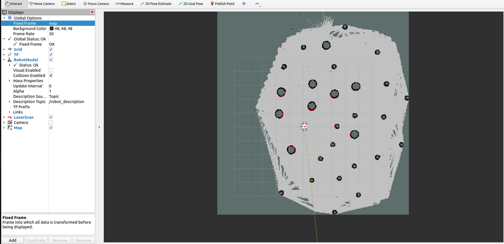

# Mibot

A differential-drive mobile robot running ROS 2, built on a low-cost 4-wheel chassis with a Raspberry Pi 4 as the on-board computer. Mibot maps its surroundings with a 2D LIDAR, streams video from an on-board camera, and can be driven by teleoperation or navigate autonomously using its SLAM-built map.



## Status

- [x] URDF/Xacro robot description
- [x] LIDAR and camera integrated in the robot model
- [x] Motors moving from ROS 2 commands
- [x] Teleoperation
- [x] SLAM (map built and visualised in RViz2)
- [ ] Full autonomous navigation with Nav2
- [ ] Simulation parity in Gazebo

## Demo

| # | What it shows | Link |
|---|---|---|
| 1 | Model complete — LIDAR and camera implemented | [Sep 17, 2024](https://x.com/fun_shoo/status/1836069345031602374) |
| 2 | Follow-up on the model + sensors | [Sep 17, 2024](https://x.com/fun_shoo/status/1836069746397057288) |
| 3 | First movement — "Finally I got my model to move" | [Oct 7, 2024](https://x.com/fun_shoo/status/1843374582771921409) |
| 4 | Teleoperation + SLAM | [Oct 19, 2024](https://x.com/fun_shoo/status/1847766340553019770) |

Below is the SLAM map built with the LIDAR while teleoperating Mibot around a room. Round obstacles are legs of chairs and stools; the coloured overlay is the live laser scan against the occupancy grid.



## Learn how it was built

The whole build follows Josh Newans' **[Building a Mobile Robot](https://youtube.com/playlist?list=PLunhqkrRNRhYAffV8JDiFOatQXuU-NnxT)** playlist on the *Articulated Robotics* YouTube channel (23 episodes). If you're recreating Mibot, that series is the primary reference — this repo just captures what changed in *my* build and how to run it end-to-end.

## Repo structure

```
Mibot/
├── README.md              # this file
├── docs/
│   ├── hardware.md        # bill of materials, wiring, assembly notes
│   ├── software.md        # ROS 2 stack, install, run instructions
│   └── images/            # photos + RViz screenshots used in the docs
└── src/                   # ROS 2 workspace source (added incrementally)
```

## Quick start

Full instructions live in [`docs/software.md`](docs/software.md). The short version, once the Pi is flashed with Ubuntu 22.04 and ROS 2 Humble:

```bash
# on the Pi
cd ~/mibot_ws
colcon build --symlink-install
source install/setup.bash

# terminal 1 — bring up the robot (motors, LIDAR, camera, robot_state_publisher)
ros2 launch mibot_bringup mibot.launch.py

# terminal 2 — teleoperate from your laptop over the same network
ros2 run teleop_twist_keyboard teleop_twist_keyboard

# terminal 3 — start SLAM
ros2 launch slam_toolbox online_async_launch.py

# terminal 4 — visualise in RViz2
ros2 run rviz2 rviz2 -d config/mibot.rviz
```

## Hardware at a glance

| Part | What I used |
|---|---|
| Chassis | 4-wheel plastic "smart car" chassis with knobby off-road wheels |
| Compute | Raspberry Pi 4 (4 GB) in a red case |
| Motor driver | L298N dual H-bridge |
| Motors | 4 × DC gear motors as a differential drive — 2 front (yellow TT, plain) + 2 rear (encoded, one per side, feeding real odometry) |
| Sensors | 2D LIDAR, on-board camera |
| Power | Energizer USB power bank (Pi) + separate battery pack for motors |

Full parts list and wiring in [`docs/hardware.md`](docs/hardware.md).

## Software at a glance

- **OS:** Ubuntu 22.04 on Raspberry Pi 4
- **Middleware:** ROS 2 Humble
- **Robot description:** URDF/Xacro with meshes for the chassis, wheels, LIDAR and camera
- **Control:** `ros2_control` with `diff_drive_controller`
- **SLAM:** `slam_toolbox` (async online mode)
- **Teleop:** `teleop_twist_keyboard` (keyboard) / `teleop_twist_joy` (gamepad)
- **Visualisation:** RViz2

Full stack and install steps in [`docs/software.md`](docs/software.md).

## Credits

- Built by [@fun_shoo](https://x.com/fun_shoo) — Muqaddis Adedeji Olopade
- Tutorial series: [Articulated Robotics — Building a Mobile Robot](https://youtube.com/playlist?list=PLunhqkrRNRhYAffV8JDiFOatQXuU-NnxT) by Josh Newans

## License

TBD — pick one before making the repo public in a serious way (MIT and Apache 2.0 are the usual defaults for hobby robotics).
